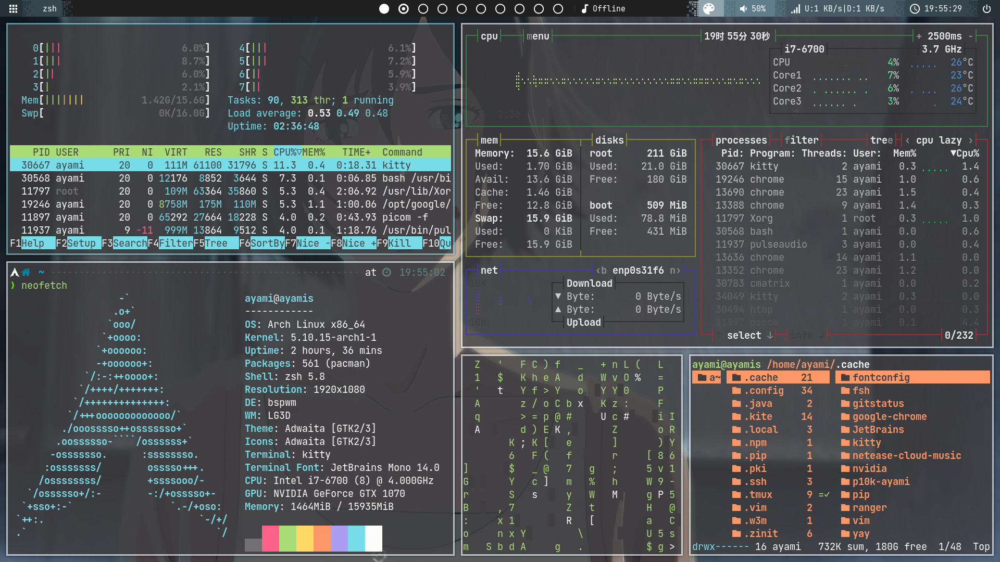

README

# <center>My ArchLinux dotflie</center>

- ## ScreenShot


- ## Used packages
	0. **bspwm** 
		- 
	1. **sxhkd**
		- 
	2. **polybar**
		- theme
		Use [polybar-themes](https://github.com/adi1090x/polybar-themes)
	3. **rofi**
		- theme
		Use [rofi-themes](https://github.com/davatorium/rofi-themes)
	4. **alacritty**
		- theme
		Use [alacritty-themes](https://github.com/eendroroy/alacritty-theme)
			- How to install
			```
			$ yay -S npm
			$ npm install -g alacritty-themes
			$ alacritty-themes
			```
	6. **tmux**
		- config use [.tmux](https://github.com/gpakosz/.tmux)
	7. **zsh**
		- 
	8. **zinit**
		- plugin manager for zsh
	9. **powerlevel10k**
		- Install
			I use zinit install all zsh plugins,see my ***.zshrc*** file
		- More Infomation -> [zinit](https://github.com/zdharma/zinit)
	11. **feh**
		- 
	12. **picom**
		- 
	13. **ranger**
		- 
	14. **bashtop**
		- 
	15. **htop**
		- 
	16. **neofetch**
		- 
	17. **cmatrix**
		- 
	18. **flameshot**
		- 
	19. **joplin-desktop**
		- 
	20. **netease-cloud-music**
		- 
	21. **wps-office-cn**
		- 
	22. **PyCharm**
		- 
	23. **kite**
		- 
